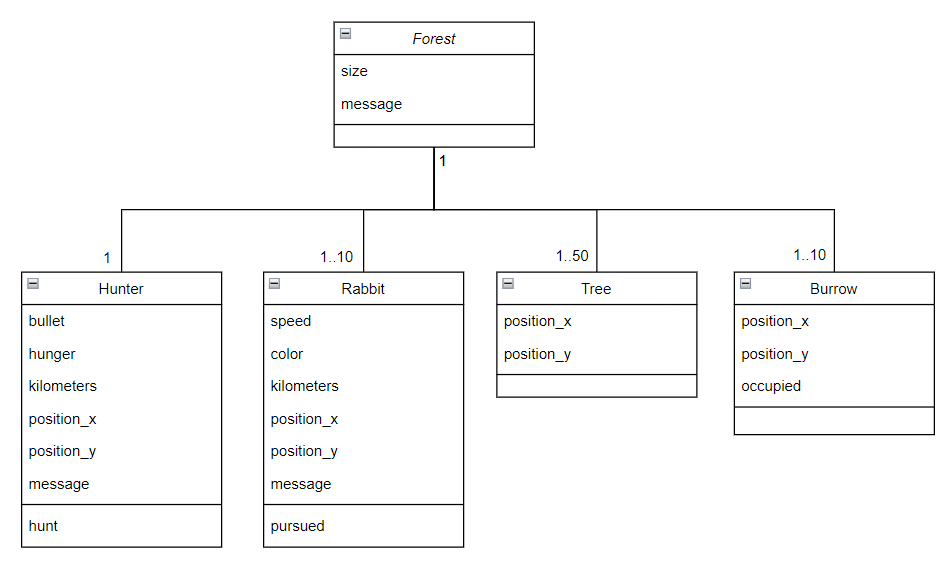
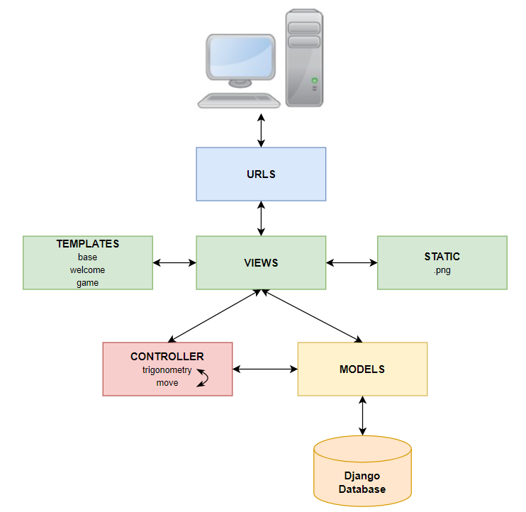

# Bunny Hunt

## Description
This application creates a forest containing a hunter, rabbits, trees and burrows. The size of the forest, the number of rabbits, trees and burrows are determined by the initial conditions.
The application automatically manages the movements of the hunter and the rabbits each time the “Mouvement suivant” button is pressed. The hunter loses if he has not killed any rabbits when he runs out of bullets. Rabbits must always win.

This application uses a Django database to store forest data in real time.

This application use Python 3.11, Django 4.2 and Bootstrap 5.

## Installation

Install Python `3.11+`.

## Usage

In django-bunny-hunt directory :
```bash
venv\Scripts\activate 
```

In bunnyhunt directory :
```bash
python manage.py runserver
```
This application will be visible at this url :</br>
http://127.0.0.1:8000/

## Tests

In bunnyhunt directory :
```bash
python manage.py test 
```

## Database migration

In bunnyhunt directory :
```bash
python manage.py makemigrations
```
```bash
python manage.py migrate
```

## Departure conditions

The constants.py file contains the following elements :</br>
- The size of the forest
- The number of rabbits
- The number of trees
- The number of burrows
- The hunter's starting position
- The number of hunter's bullets
- The distance between a rabbit and the hunter at which the rabbit feels in danger and flees.

## UML diagram



## MVC diagram


